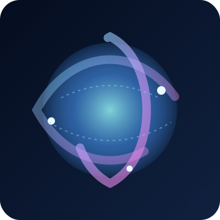

# 🎧 Radha's DevOps Playground

> Energizing cloud journeys with an AI-first operations pulse.

## 🛡️ Tech Badges

## 🚀 About Me

- 🌍 Toronto-based DevOps engineer who thrives on high-impact migrations and scaling stories.
- 🧩 Love untangling legacy monoliths, reshaping them into resilient Kubernetes workloads.
- ⚡ Latest obsession: blending GitHub Actions, ArgoCD, and Terraform into zero-downtime delivery pipelines.

## 🛠️ Toolbelt

| Cloud | Containers & Orchestration | IaC & Automation | Observability & Security | Data |
| --- | --- | --- | --- | --- |
| AWS · GCP | Docker · Kubernetes · Helm | Terraform · Ansible · GitHub Actions · GitHub Pages | ELK Stack · Grafana · Loki · Keycloak | MongoDB · PostgreSQL |

## 📟 What's Cooking

- 🔄 Replatforming on-prem apps into Kubernetes clusters with automated day-2 operations.
- 🛡️ Baking compliance checks into CI/CD using policy-as-code.
- 🔭 Tracking golden signals through Grafana dashboards and Loki log pipelines.

## 🎬 Motion Gallery

| Neural Loop | Sky Pulse |
| --- | --- |
|  |  |

## 🧠 Certifications & Highlights

- ✅ Terraform Certified Associate in progress (countdown at 80% complete).
- 🏅 Spearheaded a 200+ microservice migration with zero customer downtime.
- 🧪 Built ephemeral preview environments with Helmfile + GitHub Actions.

## 🎯 Impact Snapshot

| Metric | Highlight |
| --- | --- |
| ⏱️ Deployment tempo | Pushed lead time from days to hours with GitHub Actions + ArgoCD blue/green patterns |
| 📈 Reliability lift | 40% reduction in incident noise via observability stack redesign |
| 🤝 Team Upskilling | Ran hands-on Kubernetes bootcamps for cross-functional squads |

## 🌐 Connect & Collab

- 📫 Drop a note: [chradha0011@gmail.com](mailto:chradha0011@gmail.com)
- 📸 Instagram vibes: [@radha_ch18](http://www.instagram.com/radha_ch18)
- ✍️ Medium deep-dives: [medium.com/radhakrishna](http://www.medium.com/radhakrishna)
- 💻 GitHub playground: [github.com/radhakrishna0018](https://www.github.com/radhakrishna0018)

## 📊 GitHub Snapshot

| | |
| --- | --- |
|  |  |

> “Infrastructure as code is my canvas; uptime is the art.”

